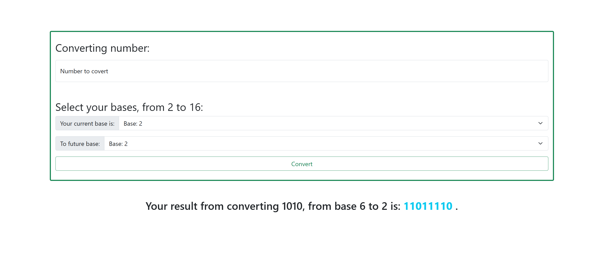

# Conversion Base

## Overview
The Conversion Base Django application allows users to convert numbers between bases 2 and 16. Users can input a number, select its current base, and the desired future base to see the conversion result.

## Screenshot

